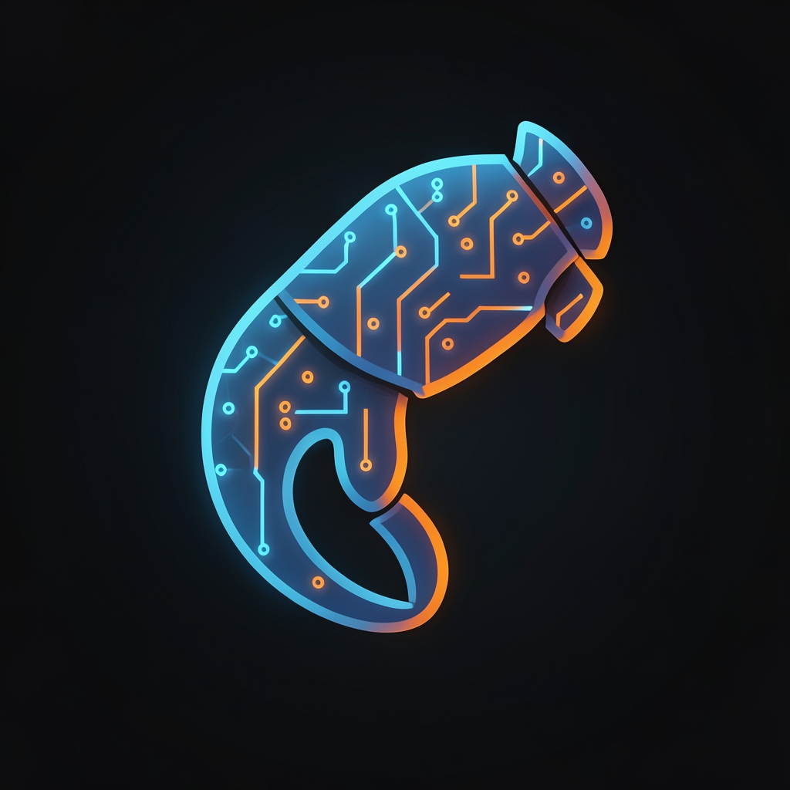

<p align="center">
  
</p>

# EdgeClaw

**OpenClaw on Cloudflare Workers.** Persistent personal AI assistant running on CF Durable Objects + Workers AI — no server, no machine, no SQLite file to babysit.

## What this is

[OpenClaw](https://github.com/openclaw/openclaw) runs as a local daemon on your machine: SQLite for state, a long-running process for channel connections, your own hardware for LLM inference. EdgeClaw takes the same model and runs it on Cloudflare's edge:

| OpenClaw (local) | EdgeClaw (CF Workers) |
|---|---|
| SQLite per agent | Durable Object per agent (SQLite-backed) |
| Local daemon process | DO hibernation — always available, no idle cost |
| LanceDB vector memory | Vectorize (coming) |
| LLM API calls | Workers AI (free inference) |
| Channel socket listeners | Incoming webhooks |
| `~/.openclaw/` filesystem | KV + R2 |

Same idea. 300 edges. No machine required.

## Deploy in 5 minutes

```bash
git clone https://github.com/Stackbilt-dev/edgeclaw
cd edgeclaw
npm install

# Create KV namespace
npx wrangler kv:namespace create edgeclaw-skills
# Paste the returned id into wrangler.toml → kv_namespaces[0].id

# Deploy
npx wrangler deploy

# Set your channel secrets
npx wrangler secret put TELEGRAM_BOT_TOKEN
npx wrangler secret put TELEGRAM_SECRET

# Wire Telegram webhook
curl "https://api.telegram.org/bot<TOKEN>/setWebhook" \
  -d "url=https://edgeclaw.<your-subdomain>.workers.dev/channels/telegram&secret_token=<SECRET>"
```

That's it. Message your bot.

## Channels

| Channel | Status | Setup |
|---------|--------|-------|
| Telegram | ✅ | `wrangler secret put TELEGRAM_BOT_TOKEN` + setWebhook |
| Slack | ✅ | `wrangler secret put SLACK_SIGNING_SECRET SLACK_BOT_TOKEN` |
| HTTP REST | ✅ | `POST /chat` — for testing and integrations |
| WhatsApp | 🔜 | Coming |
| Discord | 🔜 | Coming |

## Architecture

```
Channel webhook → Hono router → AgentSession DO (per user)
                                      ↓
                               Workers AI (Llama 4 Scout)
                                      ↓
                          SQLite history + KV memory
```

Each user gets their own `AgentSession` Durable Object — persistent conversation history, isolated state, hibernation when idle (no compute cost). Workers AI handles inference (free on Cloudflare's network).

## Adding skills

Skills are functions registered on the AgentSession. Drop a file in `src/skills/` and import it in `agent-session.ts`. Skills can read/write KV, call external APIs, or query D1. The model calls them via tool use.

See `src/skills/` for examples (coming).

## Relation to AEGIS

EdgeClaw uses the same Cloudflare primitives as [AEGIS](https://github.com/Stackbilt-dev/aegis) (the production cognitive kernel), but packaged as a clean deployable template for personal use. If you want the full thing — memory layers, autonomous goals, scheduled tasks, multi-agent governance — run AEGIS. If you want a personal assistant on CF in 5 minutes, start here.

## License

MIT — same as OpenClaw.
